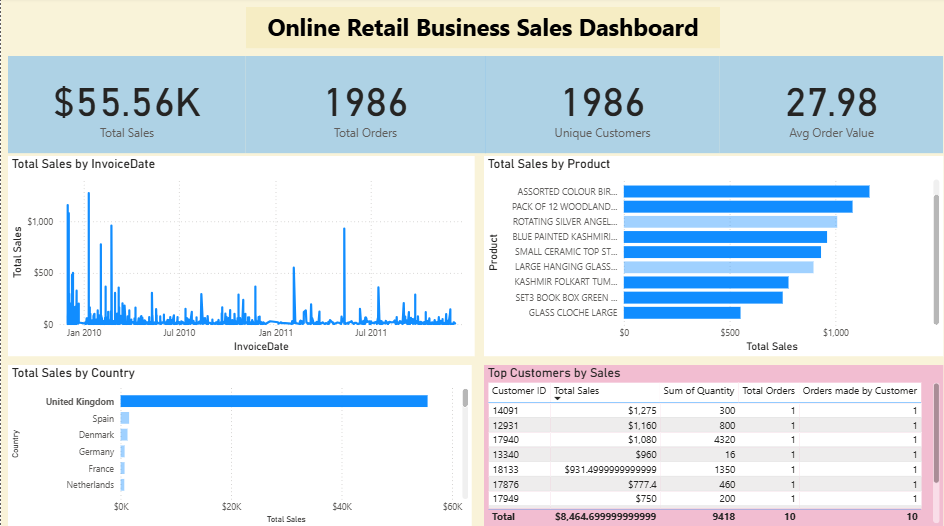

# FUTURE_DS_01
Data Science Task 1
#  E-Commerce Sales Dashboard

**Internship Track**: Data Science & Analytics  
**Organization**: Future Interns  
**Intern**: Mugumya Timothy Kitulazi  
**Task**: E-Commerce Sales Dashboard (2011–2014)

---

## 📌 Task Objective

Analyze e-commerce sales data to extract valuable business insights, including:  
- 🛒 Identification of best-selling products  
- 📅 Visualization of monthly sales trends and seasonality  
- 🌍 Analysis of sales performance by country  
- 📈 Key metrics for revenue, orders, and customer behavior to support decision making  

---

## 📊 Tools & Technologies Used

- Power BI Desktop (latest version)  
- DAX (Data Analysis Expressions) for calculated measures and KPIs  
- Interactive visuals: Cards, Line Charts, Bar Charts, Maps, and Tables  

---

## 📈 Key Insights & Features

- 🎯 Four KPI cards tracking Total Sales, Total Orders, Unique Customers, and Average Order Value  
- 📊 Time series line chart revealing seasonal sales patterns by month  
- 🥇 Top 10 products ranked by revenue using a bar chart  
- 🌍 Geographical sales distribution displayed on a map visual  
- 👥 Top customers table showing sales, order counts, and quantities  
- 🔎 Slicers for Year, Country, and Product filters enabling dynamic exploration  

---

## 📷 Dashboard Preview

---

## 📄 Files Included

- `E-commerce sales dashboard.pbix` – Power BI Desktop report file  
- `README.md` – Project documentation  
- `assets/dashboard_screenshot.png` – Dashboard screenshot preview  

---

## 🔗 Connect with Me

Mugumya Timothy Kitulazi  
[LinkedIn Profile](https://www.linkedin.com/in/mugumya-timothy-kitulazi-711052217)

---

## 📖 How to Use

1. Download and open the `E-commerce sales dashboard.pbix` file in Power BI Desktop.  
2. Use the slicers at the top to filter the data by year, country, and product.  
3. Interact with the visuals — clicking on products or countries filters all related charts and KPIs.  
4. To share insights, publish the report to Power BI Service and create dashboards or share links.  

---

 ---

*Thank you for viewing my work!*  
Mugumya Timothy Kitulazi  
